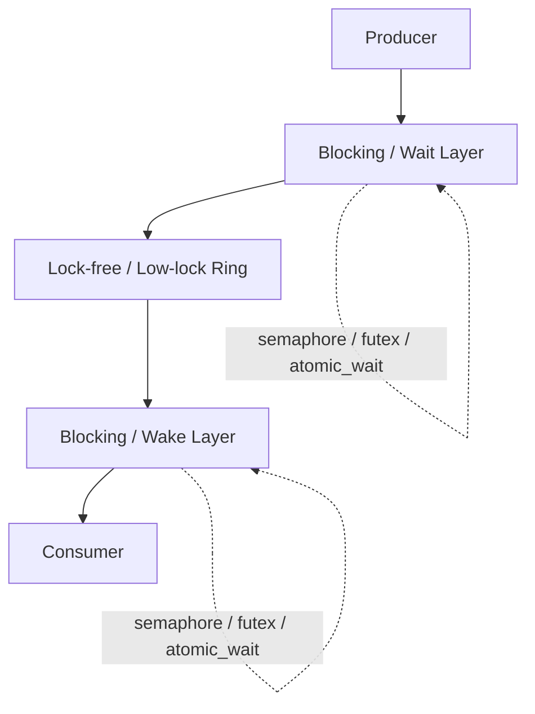
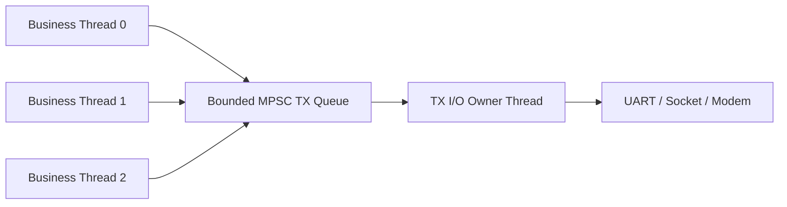
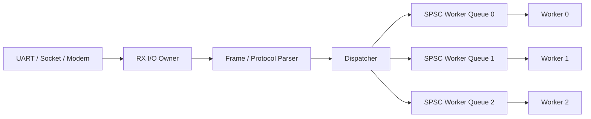
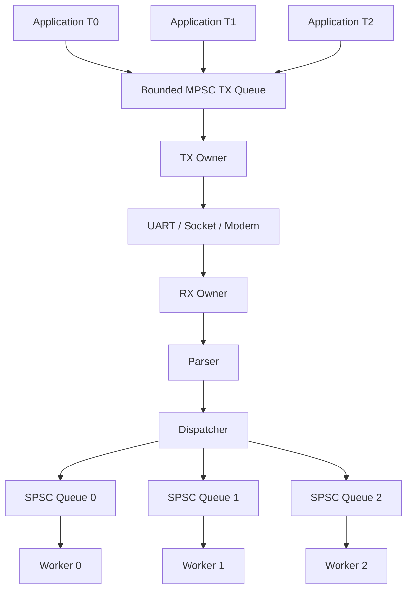
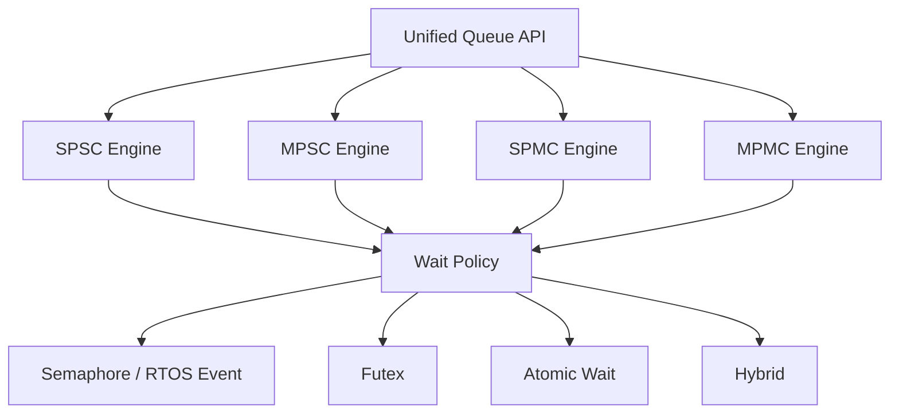

# 阻塞场景下的并发环形缓冲区设计：从 SPSC 到 MPMC

> 适用范围：Modem / RIL / oFono / UART / Socket / RTOS 通信框架、日志管线、线程池工作队列，以及其他固定容量的跨线程消息传递场景。
>
> 核心目标：在“线程可能长期阻塞、线程数可能大于 CPU 核数”的现实条件下，同时兼顾正确性、背压、低延迟、低 CPU 占用和可验证性。

---

## 1. 结论摘要

对于环形缓冲区，不应试图用一套算法覆盖所有并发模型。推荐采用“按并发拓扑选择最简单算法”的策略：

| 并发模型 | 推荐实现 | 备注 |
|---|---|---|
| SPSC：单生产者 / 单消费者 | 经典 head/tail + acquire/release | 最简单、最快，不需要 CAS |
| MPSC：多生产者 / 单消费者 | producer 端 CAS/sequence，consumer 单线程 | 非常适合 TX 请求队列 |
| SPMC：单生产者 / 多消费者 | consumer 端 CAS/sequence | 可用于 worker 分发 |
| MPMC：多生产者 / 多消费者 | per-slot sequence bounded queue | 通用共享工作队列 |
| 阻塞型 SPSC/MPSC/SPMC/MPMC | 数据路径 + semaphore/futex/atomic_wait | 不建议纯自旋 |

本报告建议的默认工程方案：

1. **SPSC 保持极简，不强行套用 MPMC。**
2. 真正需要 MPMC 时，采用 **bounded ring + per-slot sequence / turn**，而不是仅共享 atomic head/tail。
3. **数据结构并发与线程阻塞分层**：ring 负责 ownership、发布与内存顺序；semaphore/futex 负责等待、唤醒和背压。
4. **禁止在线程占有 ring slot/ticket 后执行可能阻塞的 I/O、mutex、sleep 或不可控耗时操作。**
5. 对 UART / modem / socket 等有序流设备，优先采用 **单 TX owner + 单 RX owner**，将 MPMC 降维成 MPSC/SPMC/SPSC。
6. 对 overcommitted 系统（线程数 > CPU 核数）谨慎使用纯 spin lock-free；参考 DPDK RTS/HTS，或直接采用 blocking queue。
7. MCU/RTOS 上必须确认 atomic 是否真的 lock-free；没有合适 CAS 指令时，**短临界区 + semaphore** 往往优于模拟 64-bit atomic。

---

## 2. 为什么传统 SPSC Ring 不能直接扩展成 MPMC

经典 SPSC 环形缓冲区通常只有两个索引：

```text
Producer                         Consumer
   head                           tail
     |                              |
     v                              v
+----+----+----+----+----+----+----+----+
| A  | B  | C  |    |    |    |    |    |
+----+----+----+----+----+----+----+----+
```

SPSC 有一个非常重要的隐含条件：

- 只有 producer 修改 `head`；
- 只有 consumer 修改 `tail`；
- 双方只读取对方的索引。

因此不需要 CAS，使用 acquire/release 即可建立“先写 payload，再发布 head”的 happens-before 关系。

Linux Kernel 的 Circular Buffers 文档也明确说明，其无锁 head/tail 用法要求单 producer 和单 consumer；多个 producer 或 consumer 需要额外串行化。

### 2.1 SPSC 推荐内存顺序

```cpp
struct SpscRing {
    alignas(64) std::atomic<uint32_t> head;
    alignas(64) std::atomic<uint32_t> tail;
    Item buffer[N];
};
```

Producer：

```cpp
auto head = ring.head.load(std::memory_order_relaxed);
auto tail = ring.tail.load(std::memory_order_acquire);

if (next(head) == tail)
    return FULL;

ring.buffer[head] = item;
ring.head.store(next(head), std::memory_order_release);
```

Consumer：

```cpp
auto tail = ring.tail.load(std::memory_order_relaxed);
auto head = ring.head.load(std::memory_order_acquire);

if (tail == head)
    return EMPTY;

item = ring.buffer[tail];
ring.tail.store(next(tail), std::memory_order_release);
```

### 2.2 不要为了 API 统一牺牲 SPSC

将 SPSC 强制使用 MPMC 的 CAS + slot sequence，会额外引入：

- CAS 竞争；
- cache line bouncing；
- slot metadata；
- 更多 memory barrier；
- 更复杂的错误处理和 shutdown；
- 更差的 tail latency。

因此建议“统一 API，不统一内部算法”。

---

## 3. MPMC 的核心难题：预留位置不等于数据已发布

错误的直觉实现：

```cpp
auto pos = enqueue_pos.fetch_add(1);
buffer[pos & MASK] = data;
```

考虑以下时序：

```text
Producer A              Producer B              Consumer
-----------             -----------             --------
reserve slot 10
<被 OS 抢占>
                        reserve slot 11
                        write slot 11
                        publish slot 11
                                                看到全局位置已推进
```

Consumer 无法仅凭 `head/enqueue_pos` 判断：

```text
slot 10: 尚未完成
slot 11: 已完成
```

因此 MPMC 需要显式区分：

```text
reserve -> write -> publish
```

并让**每个 slot 自己记录代际/状态**。

---

## 4. 推荐 MPMC 核心：per-slot sequence / turn

工程上推荐采用 Vyukov bounded MPMC 一类的设计思想，或 Rigtorp MPMCQueue 中的 ticket + turn 模型。

典型数据结构：

```cpp
struct Slot {
    std::atomic<uint64_t> sequence;
    T data;
};

struct MpmcRing {
    size_t capacity;
    size_t mask;

    Slot* slots;

    alignas(64) std::atomic<uint64_t> enqueue_pos;
    alignas(64) std::atomic<uint64_t> dequeue_pos;
};
```

初始化：

```text
slot[0].sequence = 0
slot[1].sequence = 1
slot[2].sequence = 2
...
slot[N-1].sequence = N-1
```

对 producer，某 slot 可以写入的条件是：

```text
slot.sequence == producer_position
```

Producer 写完后：

```text
slot.sequence = position + 1
```

表示 READY。

Consumer 读取后：

```text
slot.sequence = position + capacity
```

将该 slot 交给下一轮 producer。

### 4.1 Slot 状态转换

```text
sequence == pos
      |
      v
+-------------+
|  RESERVED   |
+-------------+
      |
      | write payload
      v
sequence = pos + 1
      |
      v
+-------------+
|    READY    |
+-------------+
      |
      | consume
      v
sequence = pos + N
      |
      v
+-------------+
|    FREE     |
+-------------+
```

### 4.2 为什么 sequence 优于 bool ready

简单 `ready=true/false` 存在代际混淆：

```text
false -> true -> false -> true
```

无法区分这个 `true` 属于哪一轮 ring。

sequence/turn 同时编码：

- slot 是否可写/可读；
- slot 当前属于第几轮；
- producer/consumer 的 ownership。

因此更适合作为固定容量 MPMC ring 的基础。

---

## 5. 非阻塞数据路径与阻塞策略必须分层

对于“每个线程都是阻塞场景”，纯 busy-spin 并不是完整方案。

不推荐默认使用：

```cpp
while (!ring.try_push(item)) {
    cpu_relax();
}
```

如果线程数多于 CPU 核数，或者 owner 线程被 OS 抢占，这会导致：

- CPU 被等待线程占满；
- 真正能推进队列的线程反而得不到 CPU；
- 尾延迟突然上升；
- 功耗和系统抖动增加。

推荐把系统分成两层：



职责分离：

### Ring 层

负责：

- slot ownership；
- reserve/publish；
- memory ordering；
- FIFO/代际；
- try_push/try_pop。

### Blocking 层

负责：

- backpressure；
- sleep/wakeup；
- timeout；
- shutdown/abort；
- 避免 busy loop。

---

## 6. 推荐 Blocking MPMC：两个资源计数器

固定容量队列天然存在两类资源：

```text
free_slots = capacity
ready_items = 0
```

可以映射成两个 counting semaphore：

```cpp
struct BlockingMpmcRing {
    MpmcRing ring;

    Semaphore free_slots;
    Semaphore ready_items;

    std::atomic<bool> closed;
};
```

Producer：

```text
free_slots.acquire()
        |
        v
reserve ring slot
        |
        v
write payload
        |
        v
publish slot
        |
        v
ready_items.release()
```

Consumer：

```text
ready_items.acquire()
        |
        v
reserve/read ready slot
        |
        v
consume payload
        |
        v
release slot
        |
        v
free_slots.release()
```

伪代码：

```cpp
int push(T item)
{
    free_slots.acquire();

    if (closed.load(std::memory_order_acquire)) {
        free_slots.release();
        return -ESHUTDOWN;
    }

    while (!ring.try_push(std::move(item)))
        cpu_relax(); // 理论上只应是非常短的竞争窗口

    ready_items.release();
    return 0;
}
```

```cpp
int pop(T& item)
{
    ready_items.acquire();

    if (closed.load(std::memory_order_acquire) && ring.empty_approx())
        return -ESHUTDOWN;

    while (!ring.try_pop(item))
        cpu_relax();

    free_slots.release();
    return 0;
}
```

注意：生产代码应对 close/abort 与 semaphore 计数一致性做更严格处理，上述代码仅表示结构思想。

### 6.1 为什么 semaphore 很适合 bounded queue

因为“是否可以 push/pop”本质就是资源计数问题：

- `free_slots > 0`：至少存在一个可写位置；
- `ready_items > 0`：至少存在一个已发布元素。

相比自己实现 condition-variable event protocol，计数 semaphore 更不容易出现 lost wakeup。

---

## 7. C++20 atomic_wait：适合构建轻量等待层

如果平台支持 C++20，可以考虑：

```cpp
atomic.wait(old);
atomic.notify_one();
atomic.notify_all();
```

适合实现：

```text
not_empty_epoch
not_full_epoch
```

基本模式：

```text
snapshot epoch
     |
     v
再次检查条件
     |
     +---- 条件已改变 ---> 重试 fast path
     |
     v
wait(snapshot)
```

Consumer 释放空间后：

```text
not_full_epoch++
notify_one()
```

相比纯 polling/spin，`atomic::wait` 的设计目标就是在值未改变时阻塞等待。

不过对于 RTOS、旧 libc++/libstdc++ 或平台实现不确定的项目，直接使用系统 semaphore/event 通常更可控。

---

## 8. 最危险的问题：Reservation Hole / Head-of-Line Blocking

必须规定：

> **线程一旦拿到 ring ticket / slot ownership，就只能执行有确定上界的短操作，然后立即 publish/release。**

禁止：

```cpp
reserve_slot();

read(fd);      // 禁止
write(fd);     // 禁止
sleep();       // 禁止
mutex_lock();  // 高风险
malloc();      // 实时/嵌入式场景不推荐

publish();
```

问题时序：

```text
P0 reserve slot 100
   |
   +---- 被阻塞 / 被抢占

P1 reserve 101 -> 已完成
P2 reserve 102 -> 已完成
```

如果消费必须保持严格顺序：

```text
100 ?
101 READY
102 READY
```

101/102 不能绕过 100，于是一个被阻塞的 producer 可能形成整个队列的 Head-of-Line Blocking。

因此 ring critical section 必须极短，并将所有真正可能阻塞的工作放在：

```text
reserve 之前
或
publish 之后
```

---

## 9. DPDK RTS / HTS 对 overcommitted 系统的启示

DPDK `rte_ring` 支持多种 producer/consumer 同步模式：

- SP / SC；
- MP / MC；
- MP_RTS / MC_RTS；
- MP_HTS / MC_HTS。

经典 MP/MC 很适合“一线程一核”的 DPDK 模型，但 DPDK 文档明确指出在 overcommitted 场景中可能表现较差。

### 9.1 RTS：Relaxed Tail Sync

核心思想：

- 每个线程仍竞争 head；
- 不再要求每个完成线程都等待并立即推进 tail；
- 由最后完成的一方更新 tail；
- 减少 tail 上的 spin；
- 规避 Lock-Waiter-Preemption。

适用于：

```text
线程数 > CPU 核数
调度抢占明显
共享 ring 竞争高
```

### 9.2 HTS：Head/Tail Sync

HTS 更激进：

- producer 端在某一时刻只允许一个 enqueue operation 推进；
- consumer 端同理；
- producer 和 consumer 两端仍可并行；
- 通过序列化一端的操作，避免复杂 tail waiter 问题。

它说明一个重要工程事实：

> 在被调度、阻塞和过度订阅环境里，“更少的并发”有时反而意味着更好的吞吐和延迟稳定性。

因此不要把 lock-free = 一定更快当作设计前提。

---

## 10. Modem / RIL / UART / Socket 的最佳实践：主动降维

通信设备通常最终对应一个有序字节流或消息流：

```text
UART
Socket
USB channel
Modem AT channel
IPC fd
```

此时不建议多个业务线程同时直接调用 blocking `read/write`。

### 10.1 推荐 TX 架构：MPSC + 单 TX Owner



优势：

- 底层写操作只有一个 owner；
- 保证发送顺序；
- 容易做 request_id / timeout / cancellation；
- consumer 端不需要 CAS；
- ring 竞争集中在 producer 端；
- blocking write 不会发生在 ring reservation critical section 内。

### 10.2 推荐 RX 架构：单 RX Owner + Parser + Dispatcher



相比一个共享 MPMC RX queue，这种设计有几个优点：

- RX 设备只有一个 reader；
- parser 状态天然单线程；
- dispatcher 可以按 channel/request/priority 路由；
- worker 间避免共享 dequeue_pos 的 cache contention；
- 每个 worker 队列可以是非常简单的 SPSC。

### 10.3 推荐整体结构



推荐原则：

> 能用 SPSC 就不用 MPSC；能用 MPSC/SPMC 就不用 MPMC；只有真正共享的 worker pool 才使用 MPMC。

---

## 11. 固定长度 descriptor 优于可变长度 byte ring

如果消息长度不固定，例如：

- AT command；
- RIL request；
- network packet；
- CHR/log record；

不要轻易将 MPMC ring 设计成：

```text
| len | variable payload | len | variable payload | ...
```

否则会同时引入：

- variable-size reservation；
- wrap-around 两段写；
- rollback；
- fragment；
- publish ordering；
- 多 producer 空洞管理。

更推荐：

```cpp
struct MessageDesc {
    uint32_t type;
    uint32_t len;
    void* payload;
    uint32_t request_id;
};
```

Ring 只保存：

```text
fixed-size descriptor
或
pointer/index
```

Payload 使用独立的：

- slab；
- mempool；
- fixed block pool；
- packet buffer pool。

这与 DPDK ring 存对象指针/固定元素的思想一致，也更适合嵌入式内存管理。

---

## 12. Cache Line、容量与原子类型

### 12.1 隔离 producer / consumer 热点变量

错误：

```text
Cache Line
+-----------------------------+
| enqueue_pos | dequeue_pos   |
+-----------------------------+
```

Producer 和 Consumer 会不断相互 invalidation。

推荐：

```cpp
alignas(64) std::atomic<uint64_t> enqueue_pos;
alignas(64) std::atomic<uint64_t> dequeue_pos;
```

C++17 以上可以研究 `std::hardware_destructive_interference_size`，但跨编译器/嵌入式平台仍应验证实际 cache line。

### 12.2 容量优先使用 2^N

推荐：

```text
256 / 512 / 1024 / 2048 / 4096
```

索引可以：

```cpp
index = position & (capacity - 1);
```

同时简化 wrap 与 sequence 设计。

### 12.3 RTOS/MCU 上确认 atomic 是否真的 lock-free

不要看到：

```cpp
std::atomic<uint64_t>
```

就认为它一定无锁。

检查：

```cpp
static_assert(std::atomic<uint32_t>::is_always_lock_free);
```

对于 64-bit：

```cpp
std::atomic<uint64_t>::is_always_lock_free
```

必须结合目标 MCU、编译器和 libatomic 实际确认。

在没有原生 64-bit CAS 的目标上，库实现可能退化成隐藏锁。此时更推荐：

```text
很短的 critical section / spinlock
+
RTOS semaphore
```

它往往更容易分析 worst-case latency。

---

## 13. Shutdown / Abort 是 Blocking Queue 的一等公民

Blocking queue 最容易遗漏的问题之一是退出。

例如：

```cpp
ready_items.acquire();
```

若 producer 已永久退出，consumer 可能永远阻塞。

因此 API 必须明确生命周期：

```text
OPEN
  |
  v
CLOSING
  |
  v
CLOSED
```

建议同时支持：

- `close()`：不再接受新消息，允许 drain 已有消息；
- `abort()`：立即唤醒所有 waiter，并返回错误；
- `destroy()`：只有确认不存在等待线程后才释放对象。

oneTBB 的 bounded queue 与 moodycamel blocking queue 的接口/文档也都体现了 blocking queue 生命周期管理的重要性。

---

## 14. 推荐 API

统一上层接口：

```cpp
ring_init();

ring_try_push();
ring_push();
ring_push_timeout();

ring_try_pop();
ring_pop();
ring_pop_timeout();

ring_close();
ring_abort();

ring_capacity();
ring_size_approx();

ring_destroy();
```

语义要求：

### `try_*`

- 永不 sleep；
- 不等待 OS primitive；
- queue full/empty 立即返回。

### blocking API

- 允许 semaphore/futex/atomic_wait；
- 必须支持 shutdown；
- 建议支持 timeout；
- 不允许无限 spin 作为默认实现。

### `size_approx()`

只能用于监控/诊断：

```text
不得用于决定下一步并发正确性
```

因为在 MPMC 场景它天然只是瞬时估计。

---

## 15. 推荐 Wait Policy

可以抽象：

```cpp
enum class WaitPolicy {
    None,
    Spin,
    Yield,
    Semaphore,
    Futex,
    AtomicWait,
    Hybrid,
};
```

### 默认策略

对 modem / RTOS / 系统服务类工作负载，建议：

```text
try once
   |
   +-- success -> return
   |
   v
sleep on semaphore/event
```

而不是一开始就设计几千次 spin。

### Hybrid 只在 profiling 后打开

```text
try
 -> very short spin
 -> retry
 -> sleep
```

适用于队列等待通常只有几十/几百纳秒，并且线程数不明显超过 CPU 核数的情况。

---

## 16. 设计选择矩阵

| 环境 | 首选方案 |
|---|---|
| 1 producer + 1 consumer | SPSC acquire/release |
| 多业务线程提交 TX、单设备写线程 | MPSC + blocking semaphore |
| 单 RX/parser、多 worker 抢任务 | SPMC 或 Dispatcher + N×SPSC |
| 通用共享 worker pool | bounded MPMC + per-slot sequence |
| 线程常驻 CPU、一线程一核 | lock-free + 短 spin 可接受 |
| 线程数明显大于 CPU 核数 | semaphore/futex/atomic_wait；避免无限 spin |
| 强实时 MCU、无原生宽 CAS | critical section + RTOS semaphore |
| 严格有序 I/O stream | 单 TX/RX owner，不让 N 线程直接 read/write |
| 可变长度 payload | descriptor ring + memory pool |
| 高竞争且 overcommitted | 评估 RTS/HTS 或端点串行化 |

---

## 17. 测试与验证计划

并发 ring 不应只靠普通单元测试。

### 17.1 功能测试

覆盖：

- empty/full；
- wrap-around；
- capacity = 2/4/8；
- push/pop timeout；
- close while blocked；
- abort while blocked；
- producer/consumer 提前退出。

### 17.2 并发正确性测试

每个 producer 生成：

```text
producer_id + monotonic_sequence
```

消费后验证：

- 无重复；
- 无丢失；
- 同一 producer 的 FIFO 约束；
- 总量一致；
- slot 不发生提前复用。

### 17.3 调度扰动测试

在 reserve/write/publish 等关键点随机：

```text
yield
短 sleep
CPU affinity 切换
priority inversion 模拟
```

重点暴露 reservation hole 与 waiter preemption。

### 17.4 压力模型

至少测试：

```text
1P1C
2P1C
4P1C
1P4C
4P4C
8P8C
32P32C
```

同时分别测试：

```text
threads < cores
threads == cores
threads > cores
```

### 17.5 性能指标

不要只看平均吞吐。

至少记录：

- ops/s；
- P50/P95/P99/P99.9 latency；
- context switches；
- CPU utilization；
- semaphore/futex sleep count；
- CAS retry count；
- queue occupancy high watermark；
- producer blocking time；
- consumer blocking time。

---

## 18. 最终推荐实现分层



上层 API 可以统一，但实现内部保留不同快路径。

推荐配置接口：

```cpp
QueueConfig {
    Capacity capacity;
    ProducerMode producer_mode;   // single / multi
    ConsumerMode consumer_mode;   // single / multi
    WaitPolicy wait_policy;
    ShutdownPolicy shutdown_policy;
};
```

不要实现一个“永远走最复杂 MPMC”的万能 queue。

---

## 19. 面向当前 Modem/RIL 架构的建议落地顺序

### Phase 1：先做拓扑降维

将设备访问约束为：

```text
1 × TX I/O Owner
1 × RX I/O Owner
```

业务线程禁止直接读写设备 fd。

### Phase 2：TX 使用 Blocking MPSC

```text
N × request producer
        |
        v
Bounded MPSC
        |
        v
TX Owner
```

### Phase 3：RX 使用单线程 parser

```text
RX Owner -> Parser -> Dispatcher
```

不要让多个线程共享协议 parser 状态。

### Phase 4：Dispatcher 优先拆成 per-worker SPSC

如果 workload 可以稳定 hash/route：

```text
Dispatcher -> SPSC[worker_id]
```

避免共享 MPMC dequeue 热点。

### Phase 5：只有通用 worker pool 使用 MPMC

使用：

```text
bounded
+ per-slot sequence
+ semaphore/futex blocking
+ close/abort
```

### Phase 6：完成目标板 profiling 后再引入 hybrid spin / RTS/HTS 思路

先保证：

```text
正确
可关闭
不死锁
不过度占 CPU
```

再优化纳秒级快路径。

---

## 20. 最终工程原则

可以浓缩成以下十条：

1. **按拓扑选算法，而不是所有队列都 MPMC。**
2. **SPSC 不需要 CAS。**
3. **MPMC 必须区分 reserve 与 publish。**
4. **每个 slot 使用 sequence/turn 管理代际和 ownership。**
5. **blocking/backpressure 独立于 ring 数据路径。**
6. **拿到 ticket 后绝不做可能阻塞的工作。**
7. **overcommitted 场景避免无限自旋。**
8. **UART/socket/modem 使用单 I/O owner 主动降低并发复杂度。**
9. **MCU 上确认 atomic 真正 lock-free，否则使用短临界区 + RTOS semaphore。**
10. **close/abort、压力测试、调度扰动测试与 P99 延迟属于设计的一部分，而不是后补功能。**

---

## 参考资料

1. Linux Kernel — Circular Buffers  
   https://cdn.kernel.org/doc/html/latest/core-api/circular-buffers.html

2. DPDK — Ring Library（当前文档，包含 MP/MC、RTS、HTS 与 staged ordered ring）  
   https://doc.dpdk.org/guides/prog_guide/ring_lib.html

3. Erik Rigtorp — MPMCQueue  
   https://github.com/rigtorp/MPMCQueue

4. Cameron Desrochers — concurrentqueue / BlockingConcurrentQueue  
   https://github.com/cameron314/concurrentqueue

5. oneTBB — Concurrent Queue Classes / concurrent_bounded_queue  
   https://uxlfoundation.github.io/oneTBB/main/tbb_userguide/Concurrent_Queue_Classes.html

6. C++ Reference — `std::atomic::wait` / `notify_one` / `notify_all`  
   https://en.cppreference.com/w/cpp/atomic/atomic/wait

---

## 文档状态

本报告是并发环形缓冲区与阻塞队列的架构设计基线。具体在 NuttX、FreeRTOS、Linux 或目标 MCU 上落地前，还应结合：

- CPU 架构与原子指令能力；
- cache line 大小；
- RTOS semaphore 行为；
- thread priority；
- 是否允许 priority inheritance；
- 消息大小与队列容量；
- 最坏 I/O 阻塞时间；
- 是否严格要求全局 FIFO；
- shutdown 时是否允许 drain。

进行目标平台验证和性能测试。